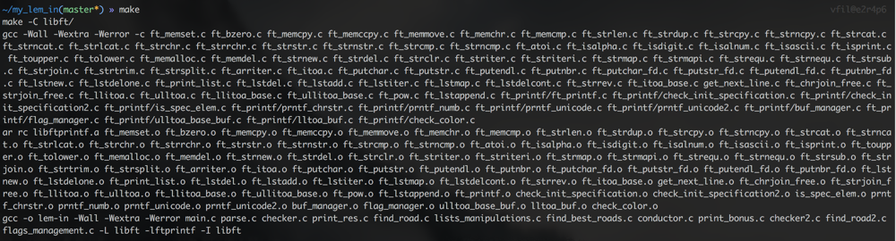
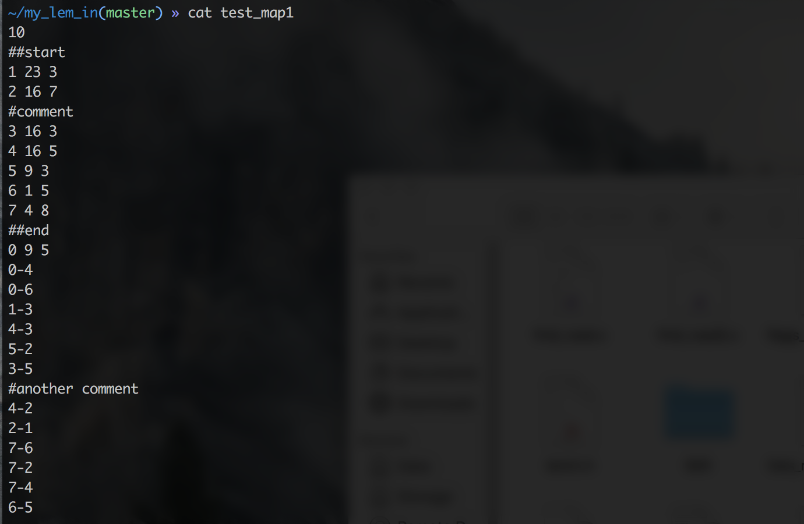
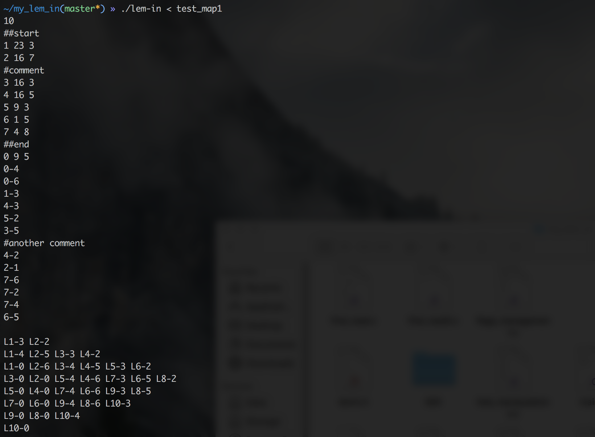

# Lem-in
The goal of this project is to find the quickest way to get n ants across the farm.

1. This project runs on the command line (UNIX).
2. You must compile this project (run `make`)

3. Run it as follows (run `./lem-in < [map name]`)
	1.	For example (map `test_map1`)

	

	Where:
	*	10 - is number of ants;
	*	##start - is command and set roomt that follows as start;
	*	##end - set roomt that follows as end;
	*	#comment - is a comment that may be any text;
	*	1, 2, 3, 4, 5, 6, 7 and 0 - are names of rooms whith coordinates:
		*	1 - start room
		*	0 - end room
	*	4-2 ... are links between rooms ('corridors')
	2.	And result is:

	

	Where:
	*	first prints map (see above)
	*	then each row means one step that "all" ants do;
	*	L[n] - is sequence number of ant;
	*	..-[name of room] - is names of room where current ant located (for exmp. L1-3 means ant "1" is in room "3");
